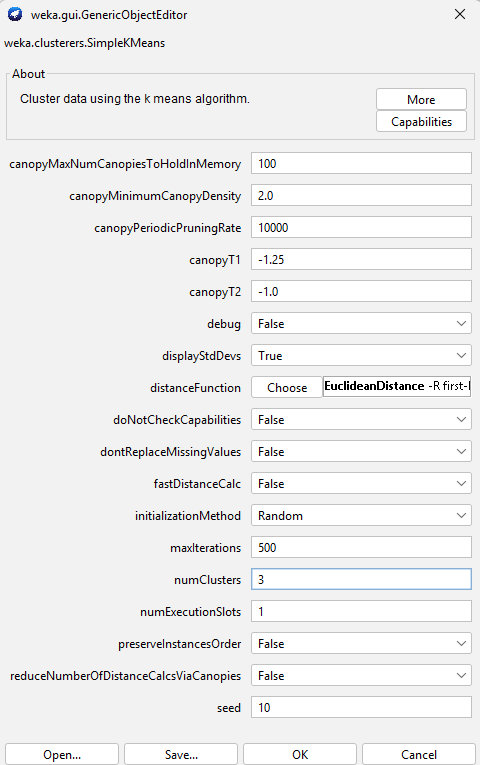{width="1.8534448818897638in"
height="2.953928258967629in"}

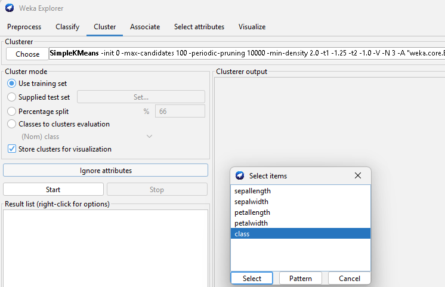{width="5.905555555555556in"
height="3.807638888888889in"}

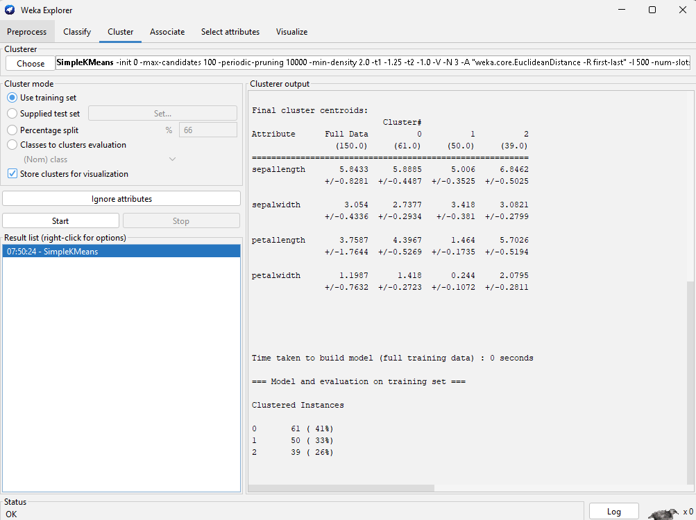{width="5.905555555555556in"
height="4.415972222222222in"}

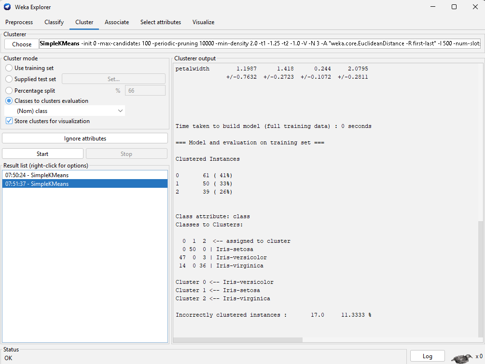{width="5.905555555555556in"
height="4.430555555555555in"}

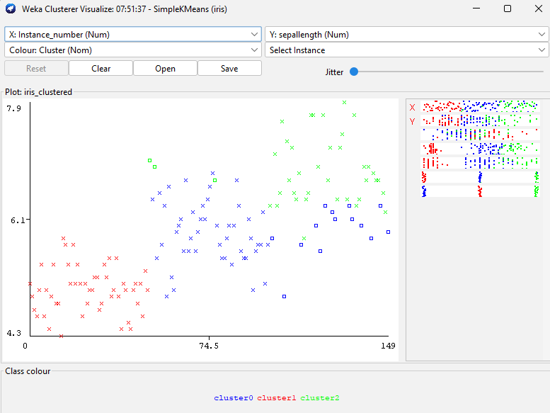{width="5.905555555555556in" height="4.43125in"}

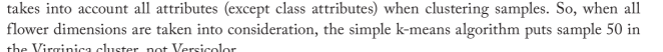{width="5.905555555555556in"
height="0.46319444444444446in"}

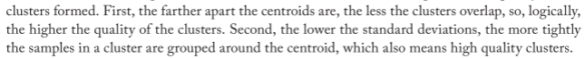{width="5.905555555555556in"
height="0.5951388888888889in"}

Cómo definir el número de clusters si la data está sin etiquetar?

Suma de errores cuadráticos

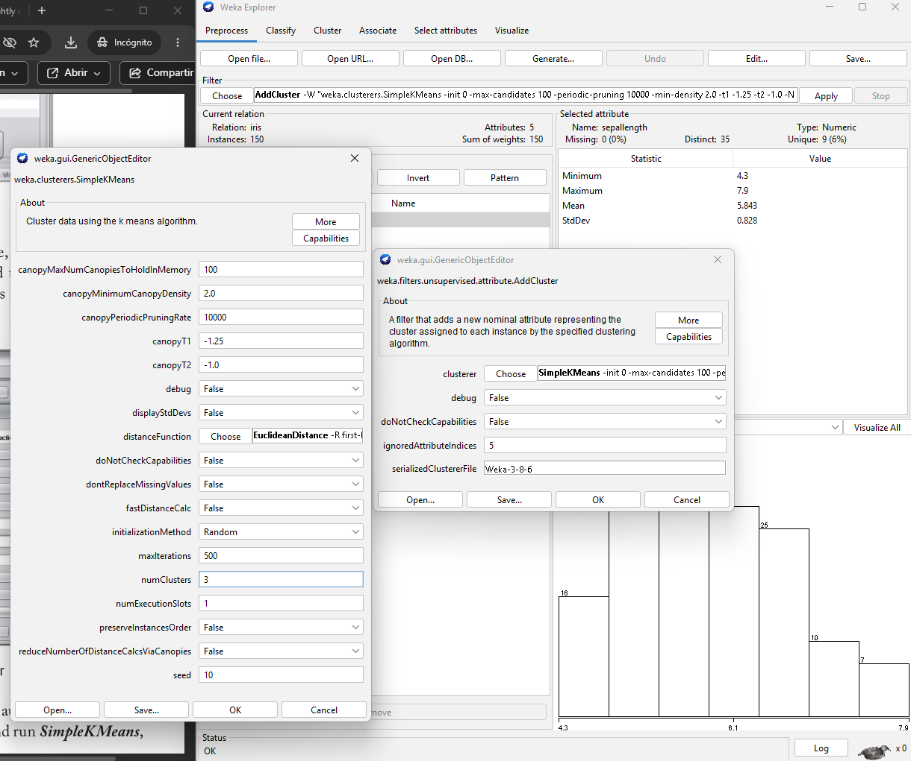{width="5.905555555555556in"
height="4.942361111111111in"}

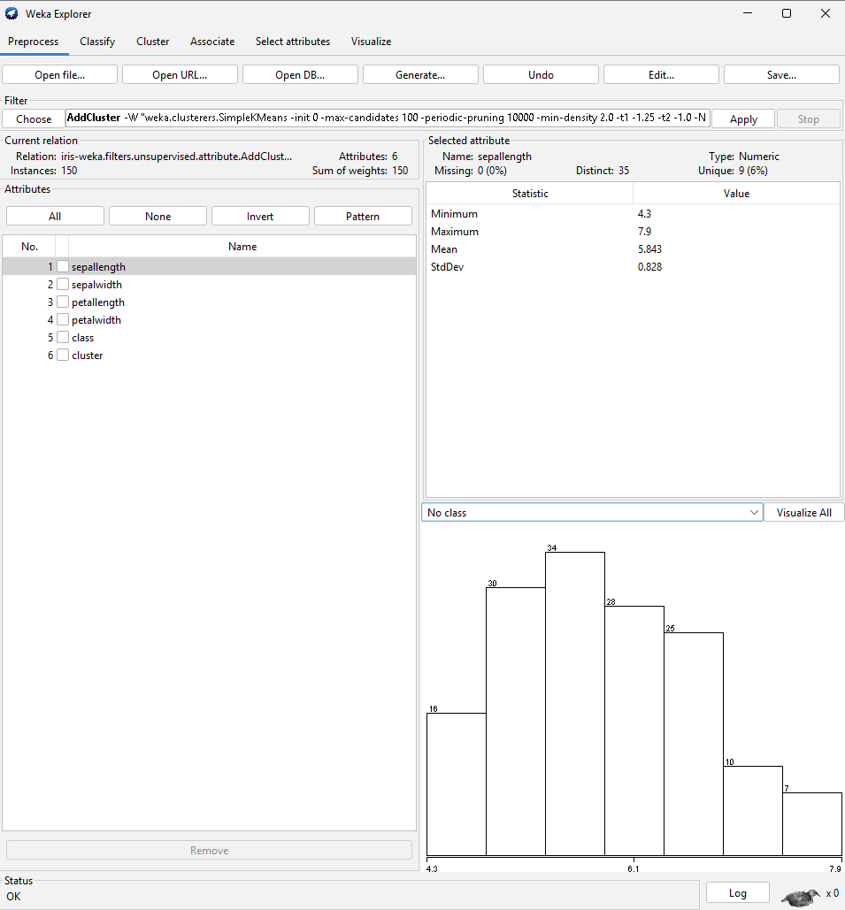{width="3.1005949256342955in"
height="3.34086832895888in"}

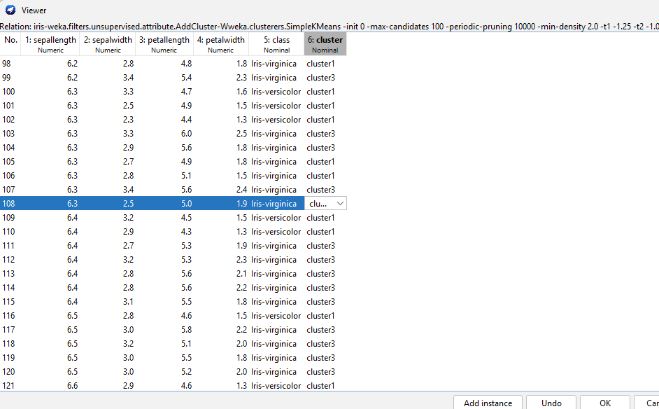{width="4.793149606299212in"
height="2.971481846019248in"}

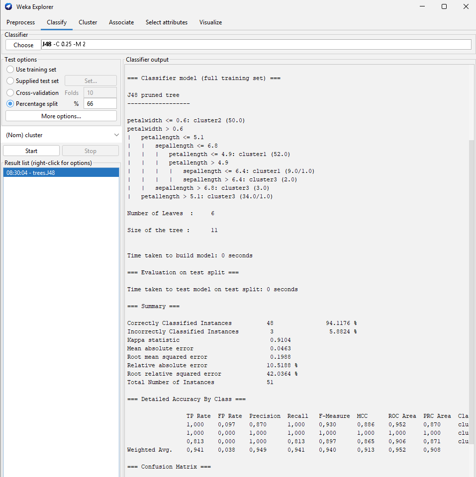{width="5.905555555555556in"
height="5.924305555555556in"}

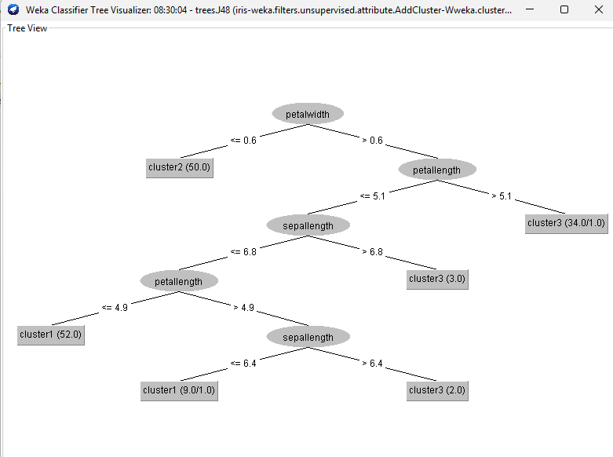{width="5.905555555555556in"
height="4.4006944444444445in"}

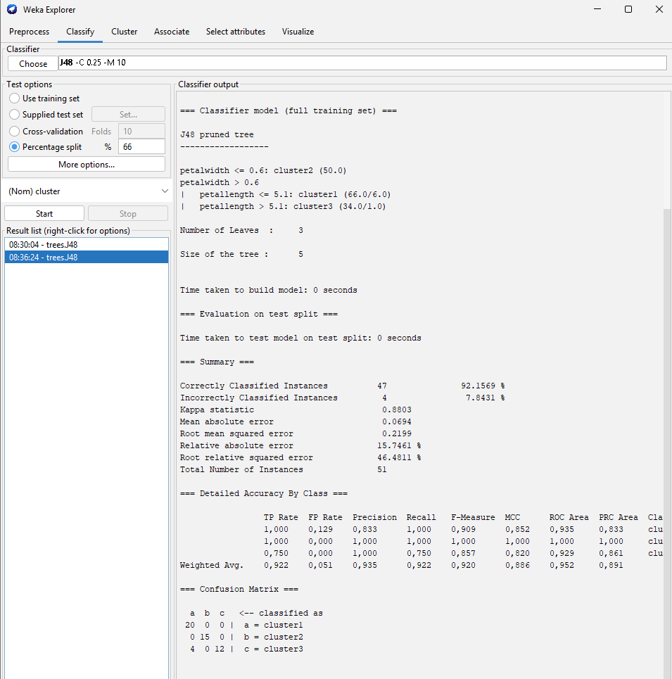{width="4.26663167104112in"
height="4.311284995625547in"}

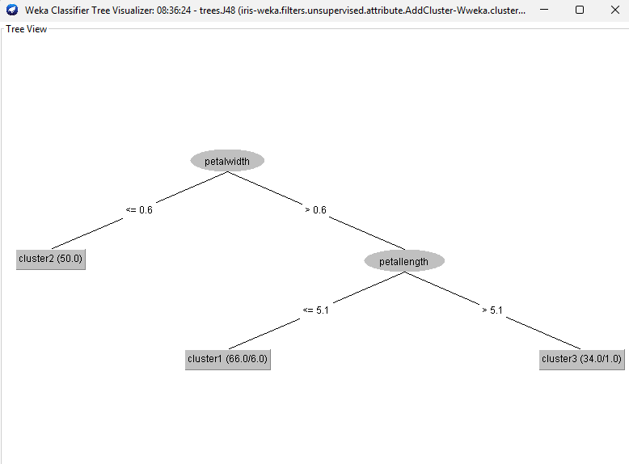{width="5.905555555555556in"
height="4.356944444444444in"}
