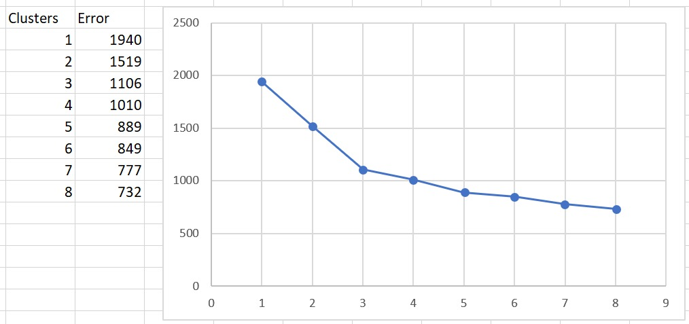
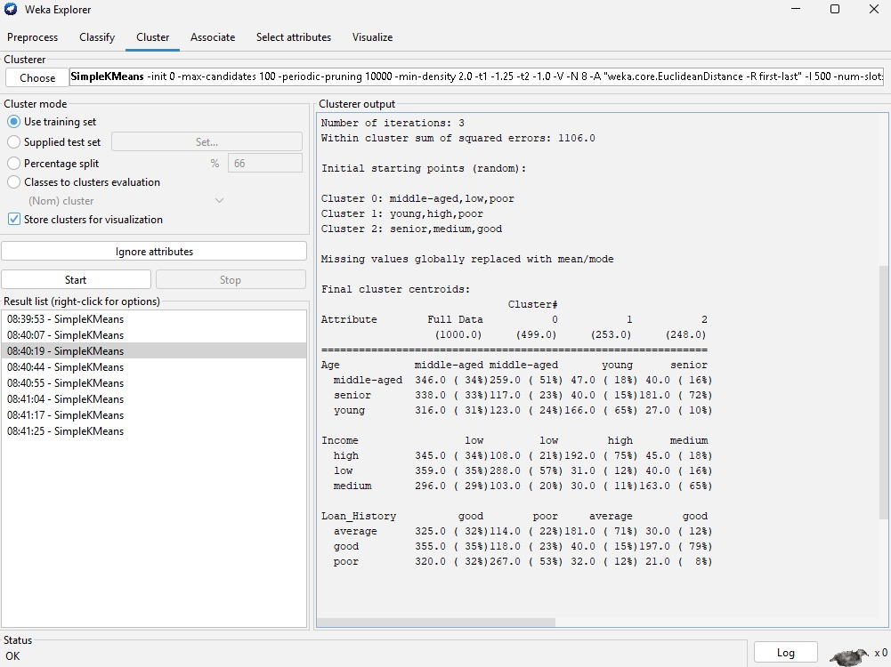
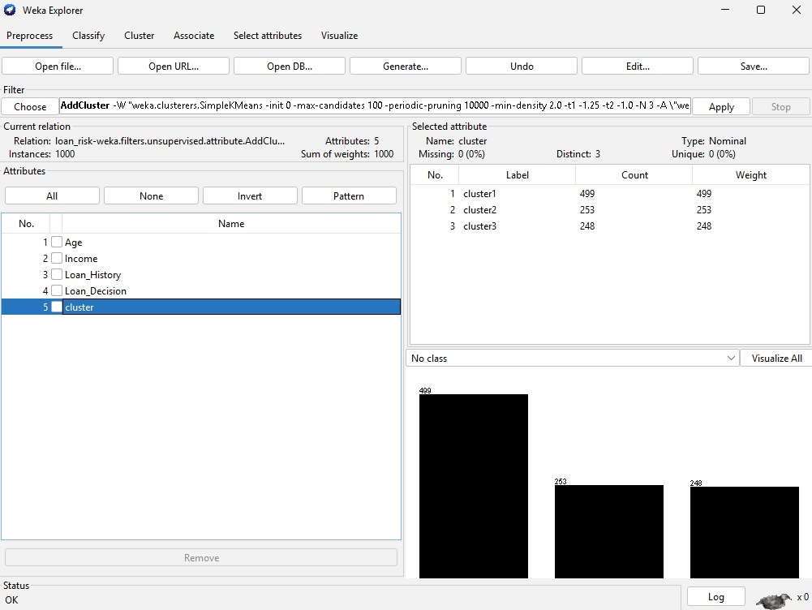
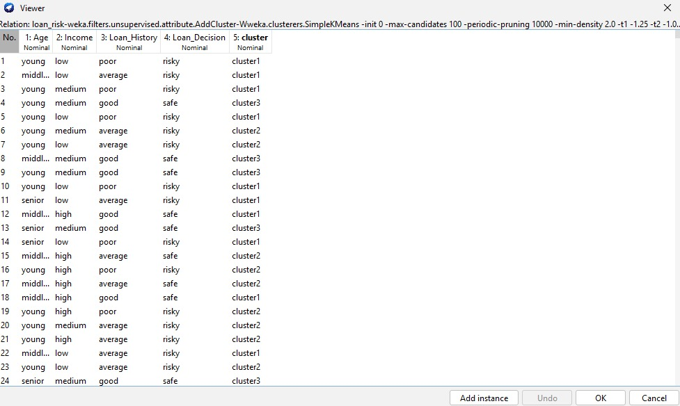
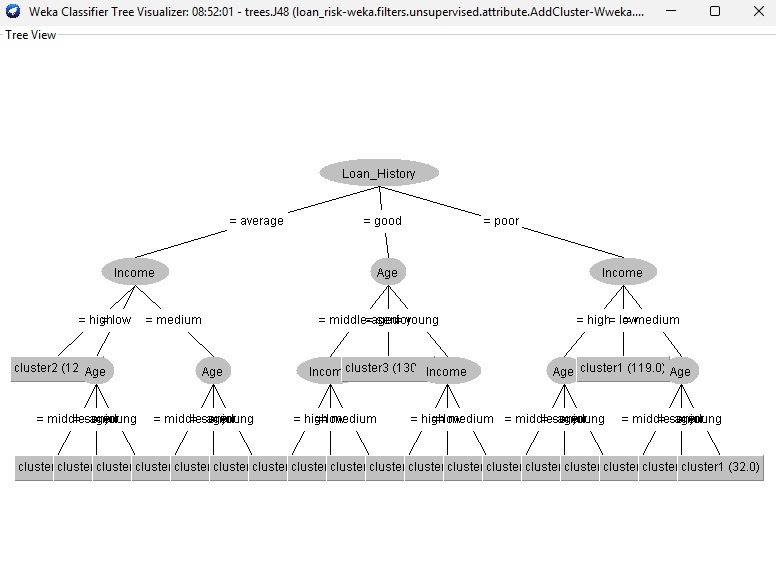

# Análisis de Clustering

## Resultados visuales

## Interpretación

El número ideal de clústeres es 3, según el método del codo y los resultados obtenidos con K-means. La gráfica de error muestra una disminución importante hasta $k=3$ y, a partir de ese punto, la mejora es menor, por lo que tres grupos representan una partición adecuada para los datos.

## Conclusión

Con esta configuración, el algoritmo separa a los clientes en tres perfiles claros:

- **Clúster 1:** clientes con mayor riesgo de no pago.
- **Clúster 2:** clientes con un riesgo intermedio o medio.
- **Clúster 3:** clientes con menor riesgo.

Esta distribución permite interpretar mejor el comportamiento de los clientes y utilizar la segmentación para apoyar decisiones de crédito.